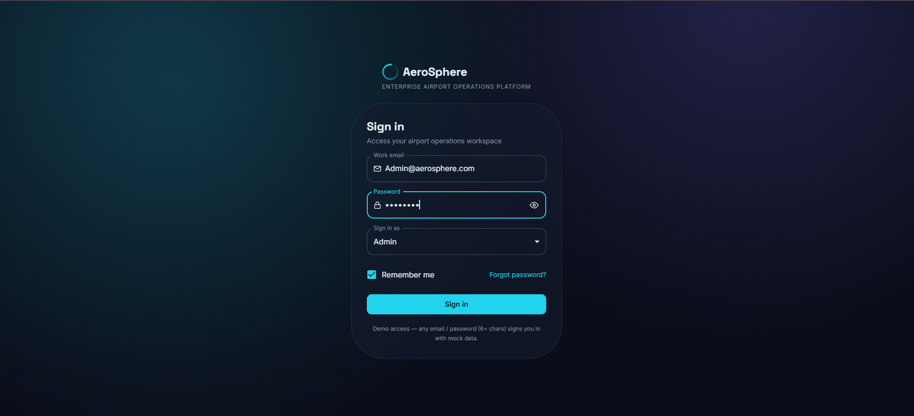
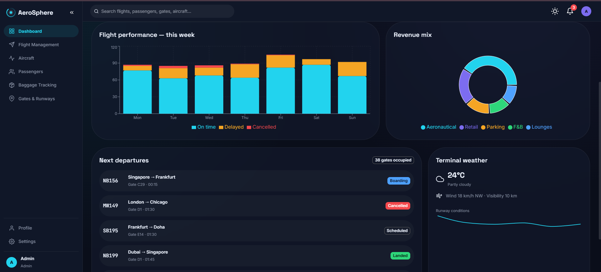
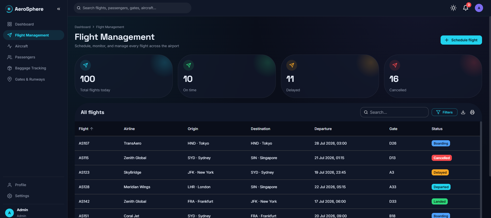
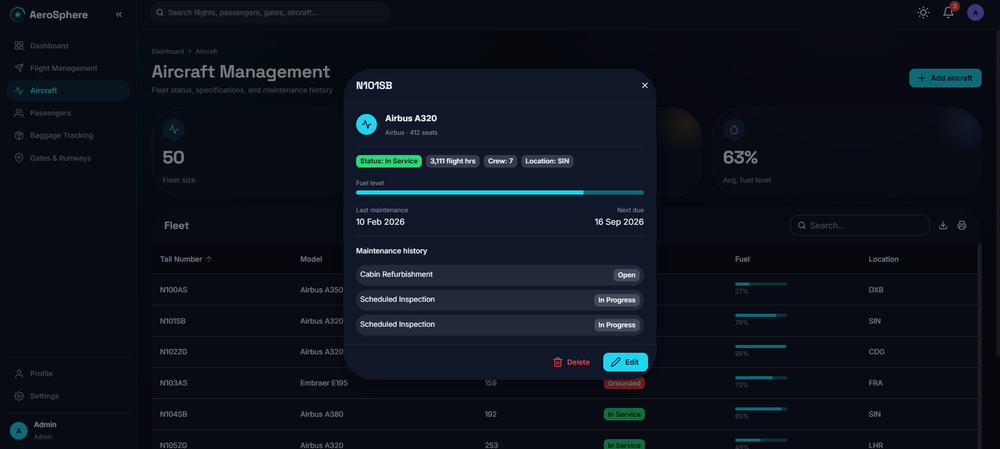
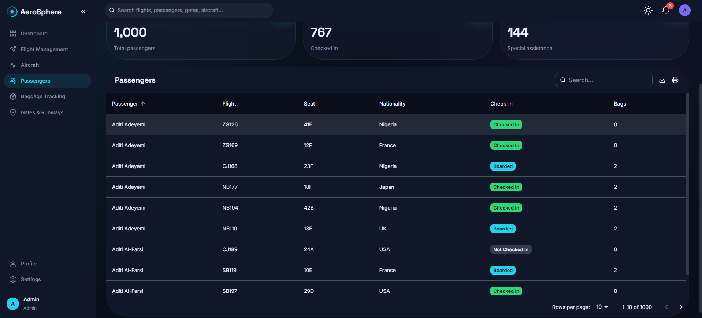
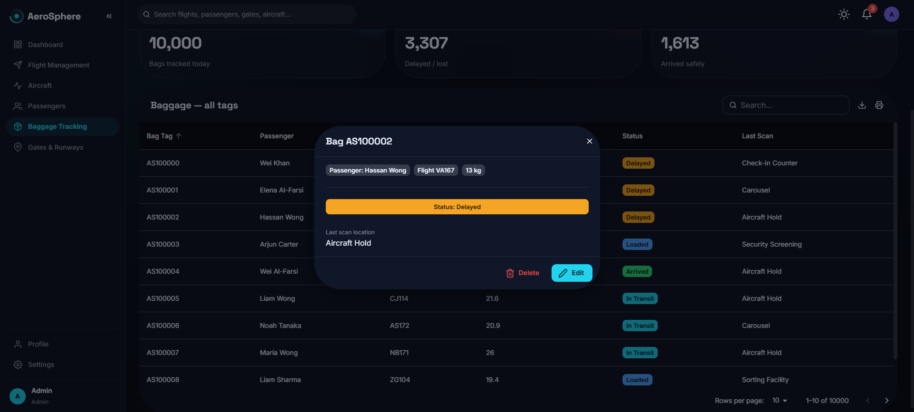
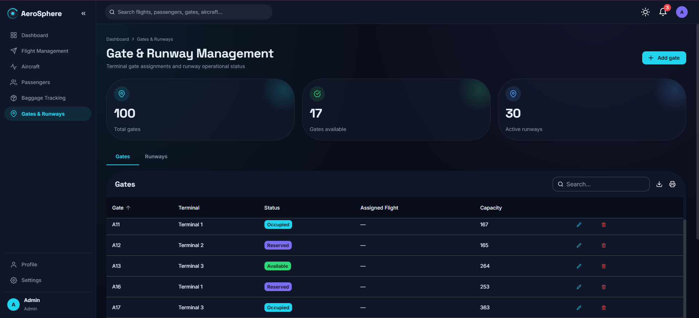
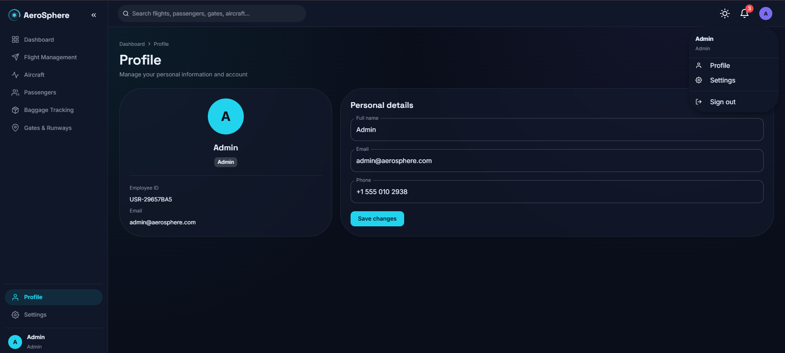
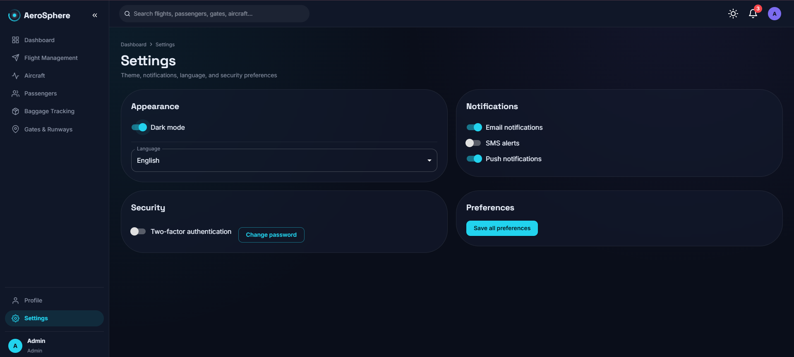

# ✈️ AeroSphere - Airport Operations Management System

AeroSphere is a full-stack **Airport Operations Management System** built to streamline airport operations through a modern, secure, and user-friendly platform. The application provides modules for authentication, flight management, aircraft management, passenger management, baggage tracking, gate management, user profiles, and dashboard analytics.

Built using **React**, **Spring Boot**, **Java 17**, and **H2 Database**, AeroSphere follows a clean client-server architecture with RESTful APIs, JWT-based authentication, and responsive Material UI components.

---

# ✨ Features

### 🔐 Authentication

- Secure JWT Authentication
- Role-Based Login
- Forgot Password
- OTP Verification
- Password Reset
- Protected Routes
- Session Timeout
- Unauthorized Access Handling

---

### 📊 Dashboard

- Operational Dashboard
- Flight Statistics
- Passenger Analytics
- Aircraft Overview
- Interactive Charts
- Quick Overview Cards

---

### ✈️ Flight Management

- View Flights
- Search Flights
- Filter Flights
- CRUD Operations
- Flight Status Management

---

### 🛫 Aircraft Management

- Aircraft Listing
- Fleet Overview
- Search Aircraft
- CRUD Operations

---

### 👥 Passenger Management

- Passenger Listing
- Search Passengers
- CRUD Operations

---

### 🧳 Baggage Tracking

- Track Baggage
- Search by Tag
- CRUD Operations

---

### 🚪 Gate Management

- Gate Allocation
- Gate Availability
- CRUD Operations

---

### 👤 User Profile

- Profile Management
- User Information

---

### ⚙️ Settings

- Application Settings
- Theme Preferences

---

# 🛠️ Technology Stack

## Frontend

- React 19
- Vite
- Material UI
- React Router DOM
- Axios
- TanStack React Query
- React Hook Form
- Recharts
- React Toastify

---

## Backend

- Java 17
- Spring Boot 3
- Spring Security
- JWT Authentication
- Spring Data JPA
- Hibernate
- Lombok

---

## Database

- H2 Database

---

## Build Tool

- Maven

---

## Version Control

- Git
- GitHub

---

# 📂 Project Structure

```text
AeroSphere
│
├── aerosphere-backend
│
├── aerosphere-frontend
│
└── README.md
```

---

# ⚙️ Installation

## Clone Repository

```bash
git clone https://github.com/arbitha34/AeroSphere.git
```

---

## Backend

```bash
cd aerosphere-backend

mvn spring-boot:run
```

Backend runs at

```
http://localhost:8080
```

---

## Frontend

```bash
cd aerosphere-frontend

npm install

npm run dev
```

Frontend runs at

```
http://localhost:5173
```

---

# 🔑 Authentication

The application uses **JWT-based Authentication** with protected routes to secure access to dashboard modules.

---

# 📸 Application Screenshots

## 🔐 Login

<p align="center">

</p>

---

## 📊 Dashboard

<p align="center">

</p>

---

## ✈️ Flight Management

<p align="center">

</p>

---

## 🛫 Aircraft Management

<p align="center">

</p>

---

## 👥 Passenger Management

<p align="center">

</p>

---

## 🧳 Baggage Tracking

<p align="center">

</p>

---

## 🚪 Gate Management

<p align="center">

</p>

---

## 👤 Profile

<p align="center">

</p>

---

## ⚙️ Settings

<p align="center">

</p>

---

# 🔒 Security

- JWT Authentication
- Spring Security
- BCrypt Password Encryption
- Protected REST APIs
- Session Timeout Management

---

# 🚀 Future Enhancements

- MySQL / PostgreSQL Support
- Docker Deployment
- Kubernetes Deployment
- Cloud Deployment (AWS/Azure)
- Real-Time Notifications
- Flight Scheduling Automation
- Role-Based Authorization
- API Documentation (Swagger)
- CI/CD Pipeline
- Live Flight Tracking

---

# 👩‍💻 Developer

**Arbitha**

Bachelor of Engineering (Computer Science and Engineering)

### Skills

- Java
- Spring Boot
- Spring Security
- JWT Authentication
- React
- Material UI
- REST APIs
- H2 Database
- Git
- GitHub

GitHub:
https://github.com/arbitha34

---

# 📄 License

This project is developed for educational purposes and to demonstrate modern full-stack application development using Java Spring Boot and React.
